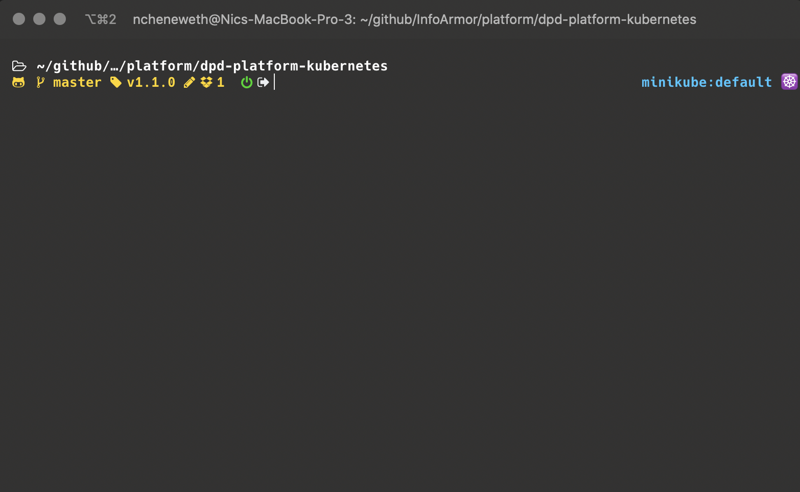

### 4. Local tools and setup

Review the [example](examples.md) using istio bookinfo to see how these tools can be used to create your local experience.  

*prereqs.sh* can be used to do a complete install of all the tools and packages described in this repo. It is designed for MacOs only at this point. Please review the scripts thoughtfully before using since, apart from Homebrew, it will attempt to install everything demo'd, including python3, Ruby, and associated packages or gems.  

You are not required to use all of these packages. Certain capabilities are naturally part of the definition of the Delivery Platform, such a kubernetes and Vault, and git-hook tools such at git-secrets are the default standard. However, there are many ways to arrive at an effective local development setup and Platform teams are encourage to socialize their own solutions.   

#### local kubernetes related packages used in this setup (recommend homebrew to manage)  

[kubectl](https://kubernetes.io/docs/tasks/tools/install-kubectl/) • kubernetes api command-line tool  
[helm](https://helm.sh) • manage pod deploys  
[kubefwd](https://github.com/txn2/kubefwd) • develop locally with remote services available as they would be in the remote cluster  
[kubectx](https://github.com/ahmetb/kubectx) • cli to quickly swtich between local or remote clusters  
[skaffold](https://github.com/GoogleContainerTools/skaffold) • continuous development on local kubernetes (pending)  
[stern](https://github.com/wercker/stern)  • tails logs to the terminal from any number of local or remote pods  
[mkcert](https://github.com/FiloSottile/mkcert) • automated management of certificates and CA for local https    

_local cli interaction with remote platform services_  
[Vault](https://www.vaultproject.io)  
[Consul](https://www.hashicorp.com/products/consul)  
[buildkite cli](https://github.com/buildkite/cli)  

_code complete_  
[hadolint](https://github.com/hadolint/hadolint) • Dockerfile lint/inspection   
[kubeval](https://github.com/garethr/kubeval) • k8 yaml lint/inspection  
[inspec](https://github.com/inspec/inspec) • for CIS testing of Docker images, and to confirm k8 health locally  (depends on Ruby)
[git-secrets](https://github.com/awslabs/git-secrets)  
[invoke]() • Like 'Make' for python, used to automate local k8s configuration (depends on Python3)

_local terminal customization_  
[kube-ps1](https://github.com/jonmosco/kube-ps1)  
[oh-my-zsh](https://ohmyz.sh)  

[Return](../README.md)